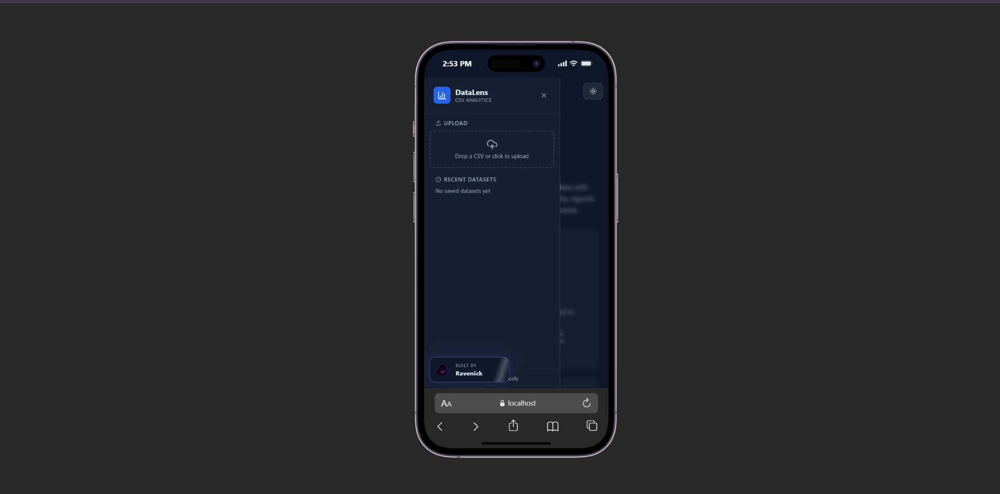
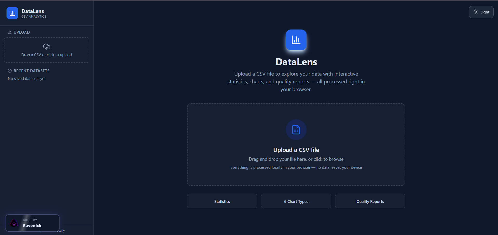

# DataLens | CSV Analytics

A browser-based CSV analytics workspace built by Nelson Emmanuel | Ravenick. DataLens turns raw CSV files into an interactive, privacy-first exploration surface with typed columns, descriptive statistics, data quality reports, charts, and a searchable data table.

> [!NOTE]
> DataLens processes uploaded CSV data locally in the browser. No backend or external data service is required for the core workflow.

## Preview




## Features

- Local CSV upload with quoted fields, embedded commas, escaped quotes, newlines, and BOM handling
- Automatic column type inference for numbers, booleans, dates, and strings
- Duplicate column name normalization for reliable data contracts
- Overview dashboard with dataset dimensions and high-level summaries
- Numeric statistics including mean, median, min, max, standard deviation, quartiles, and IQR
- Categorical statistics including missing values, unique values, and top value frequencies
- Data quality reporting for missing cells, duplicates, IQR outliers, and low-variance columns
- Interactive chart builder with histogram, bar, line, scatter, box plot, and correlation matrix views
- Sortable, paginated data table for inspecting parsed records
- Recent dataset persistence through browser local storage
- Dataset export support through the built-in export utilities
- Responsive sidebar navigation with upload and saved-dataset management
- Fixed, non-dismissible Ravenick author badge with the project logo and animated sheen
- Branded SEO metadata, social sharing metadata, favicon, and theme color

## Built With

| Tool | Use |
| --- | --- |
| React 18 | Component-driven dashboard and interactive view state |
| TypeScript | Strong dataset, chart, statistics, and quality-report contracts |
| Tailwind CSS 3 | Responsive layout, utility styling, and dashboard surfaces |
| Lucide React | Consistent interface icons |
| Vite | Development server and production compilation |
| Browser APIs | Local file reading, UUID generation, and local persistence |

## Project Structure

```text
public/
  oc-logo-no-bg.png
src/
  components/
    charts/
      BarChart.tsx
      BoxPlot.tsx
      CorrelationMatrix.tsx
      Histogram.tsx
      LineChart.tsx
      ScatterPlot.tsx
    ChartBuilder.tsx
    ColumnStats.tsx
    DataQuality.tsx
    DataTable.tsx
    FileUpload.tsx
    Overview.tsx
    Sidebar.tsx
  lib/
    chartUtils.ts
    csvParser.ts
    export.ts
    format.ts
    quality.ts
    stats.ts
    storage.ts
    types.ts
  App.tsx
  index.css
  main.tsx
index.html
package.json
vite.config.ts
```

## Run Locally

```bash
git clone https://github.com/Ravenick/datalens-cv.git
cd datalens-cv
npm install
npm run dev
```

Open the local Vite URL shown in the terminal, then upload a CSV file to begin exploring it.

Create a production build with:

```bash
npm run build
```

Run the available checks with:

```bash
npm run typecheck
npm run lint
```

## Privacy

DataLens is designed around local-first analysis. Files are read in the browser, parsed in memory, and saved only to the browser's local storage when a dataset is loaded. The application does not need an API key, account, or remote database to analyze a CSV.

## Author

Nelson Emmanuel | Ravenick

Built with React, TypeScript, and a preference for useful interfaces that make data easier to understand.
